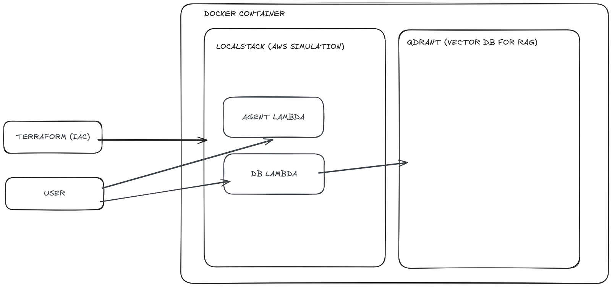

## Methodology

### Data Analysis and Model Development

I started this test by performing exploratory data analysis and building classification/regression models for the given CSV dataset. All notebooks can be found under the `/notebooks` folder.

#### Feature Engineering
I began with feature engineering in `notebooks/feature_engineering.ipynb` to prepare the data for modeling.

#### Classification Attempt
Initially, I attempted to build an XGBoost model to classify `chronic_obstructive_pulmonary_disease`. However, the results were poor. To investigate, I performed ANOVA analysis (comparing the discrete variable `chronic_obstructive_pulmonary_disease`, which has 5 categories, against continuous, binary, and other variables). The analysis revealed that essentially none of the attributes had statistical relevance for predicting `chronic_obstructive_pulmonary_disease`. Consequently, I decided not to pursue a classifier and pivoted to regression modeling.

#### Regression Model
I moved on to build a regression model for `alanine_aminotransferase`. The process is detailed in `notebooks/regression`. Through statistical analysis, I discovered that only one variable—BMI—had a significant effect on `alanine_aminotransferase` levels. Using an XGBRegressor, I was able to achieve good results. The saved model can be exposed to an LLM agent, allowing users to request `alanine_aminotransferase` predictions.

### Infrastructure Design

After completing the modeling phase, I planned the infrastructure for the solution.

The main challenge was simulating an AWS environment locally. I chose **LocalStack** because of its native integrations with Terraform, which enabled easy creation and destruction of infrastructure. This approach also allows for a relatively quick transition to real AWS with minimal code adaptations.

I used Docker Compose to provision:
- **LocalStack**: For simulating AWS services
- **Qdrant**: A vector database for performing RAG (Retrieval Augmented Generation) over markdown documents

*Note: In a production AWS environment, alternatives like S3 with vector search, OpenSearch, or pgvector could be used.*

### Document Ingestion and Processing

I developed a lambda function to create embeddings from markdown documents. After analyzing the document structure, I decided to use the `MarkdownHeaderTextSplitter` module from LangChain, which enables hierarchical clustering by splitting markdown based on header levels.

#### Metadata Extraction
I also implemented metadata extraction to support queries about specific patients or clinicians. The chunking implementation is available in `ingestion_lambda_function/utils.py`.

**Key features of the document processing:**

- **Hierarchical splitting**: Documents are split by headers (`#` for Title, `##` for Section)
- **Metadata extraction**: Automatically extracts:
  - Document ID
  - Patient ID
  - Clinician ID
  - Date Created
- **Content hashing**: Each document receives a SHA-256 hash for deduplication and version tracking
- **Parsing**: Uses regex patterns to handle various markdown formatting styles
- **Fallback**: Gracefully handles parsing failures by creating a single chunk with the first 2000 characters

The metadata extraction supports multiple markdown formats, including fields inside lists or standalone lines, and handles headers with colons or hyphens. Each chunk is indexed with its position and carries both global document metadata and section-specific metadata from headers.